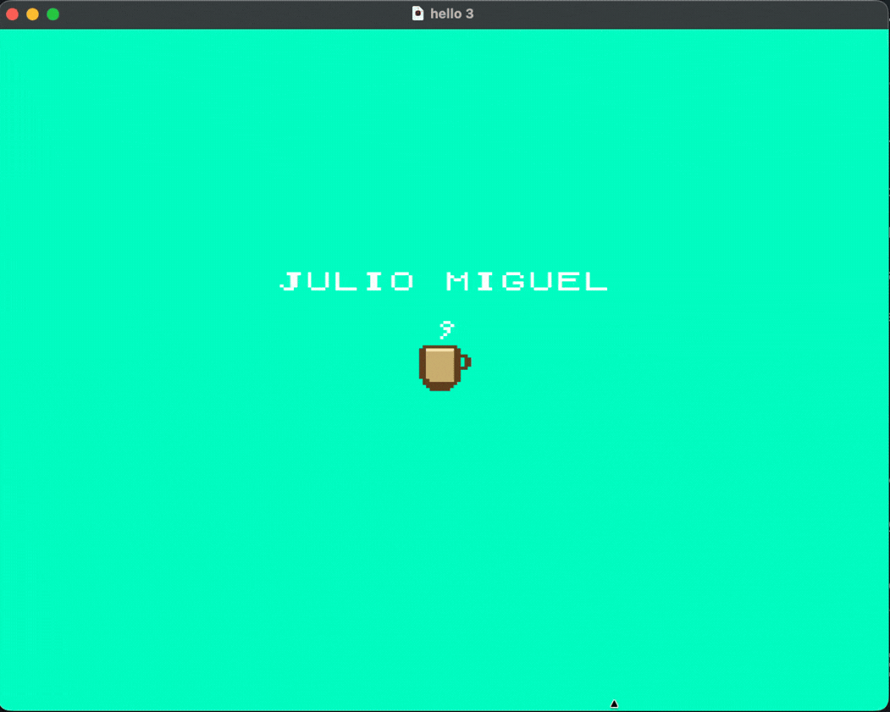

# Pangolin SNES



## Quick workflow

- `make` builds the ROM.
- `make run` builds and opens the ROM in the emulator.
- `make watch` rebuilds automatically when files are saved.

The final ROM is available at:
- `build/hello.sfc`
- `hello.sfc` (copy in the root directory for easier EverDrive use)

## Emulator

The script tries to find automatically:
- `mesen`
- `snes9x`
- `/Applications/Mesen.app/Contents/MacOS/Mesen`
- `/Applications/Snes9x.app/Contents/MacOS/snes9x`

If it cannot find one, configure it manually:

```bash
EMULATOR="/Applications/Mesen.app/Contents/MacOS/Mesen" make run
```

## VS Code

Available tasks in `Terminal > Run Task`:
- `SNES: Build`
- `SNES: Run`
- `SNES: Watch`
- `SNES: Clean`

Default build shortcut:
- `Cmd+Shift+B` -> `SNES: Build`
