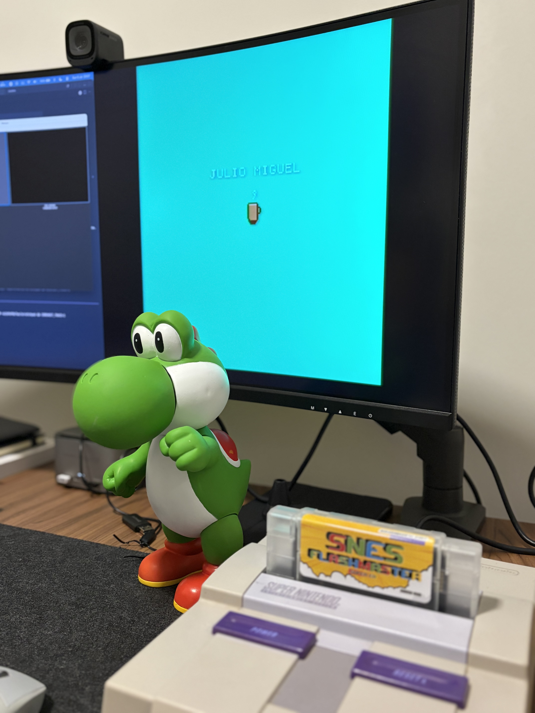

# Pangolin SNES

<p align="center">
  
</p>

My first "Olar Mundo", my first Hello World, running on a real Super Nintendo.

This repository builds a tiny LoROM program in 65816 assembly. The ROM was built
locally, copied to an EverDrive, and booted on original SNES hardware.

The current scene renders centered `JULIO MIGUEL` text, a colored background, a
sprite-based coffee cup, animated steam, and a simple fade-in.

## Why This Matters

The SNES has no OS, terminal, graphics API, or `main`. On boot, the CPU reads the
reset vector from the ROM and starts executing raw code.

Getting this image onto a real TV means the header, vectors, LoROM layout, PPU
setup, palettes, tiles, and sprites are coherent enough for the hardware.

## Project Map

| Path | Purpose |
|---|---|
| `src/hello.asm` | Main ROM source: header, vectors, reset code, graphics setup, sprites, and loop. |
| `src/snes.cfg` | `ld65` linker layout for the 32 KB LoROM image. |
| `assets/font.bin` | 2bpp font data for BG1 text. |
| `Makefile` | Build pipeline from assembly to `hello.sfc`. |
| `scripts/run_emulator.sh` | Opens the ROM in OpenEmu, Mesen, or Snes9x. |
| `scripts/watch.sh` | Rebuilds when source or asset files change. |

## Build

```text
src/hello.asm
  -> ca65
build/hello.o
  -> ld65 + src/snes.cfg
build/hello.sfc
  -> cp
hello.sfc
```

Commands:

```bash
make
make run
make watch
make clean
```

The final ROM is available at:

- `build/hello.sfc`
- `hello.sfc` for emulator use or EverDrive transfer

## Emulator

`make run` tries to find OpenEmu, Mesen, or Snes9x automatically.

You can also set an emulator explicitly:

```bash
EMULATOR="/Applications/Mesen.app/Contents/MacOS/Mesen" make run
```

## Hardware Notes

Real hardware can boot with stale or undefined register values. `src/hello.asm`
enters forced blank and initializes the important CPU/PPU registers before drawing.

The header checksum is still a placeholder. It did not block this EverDrive run.
If stricter flashcarts or ROM validators become a target, a checksum step can be
added back later.

## Next Steps

- move more sprite/tile data out of hand-written assembly;
- switch from VBlank polling to NMI;
- write OAM data through a WRAM buffer;
- read controller input;
- turn the cup/sprite work into a simple controllable object.
